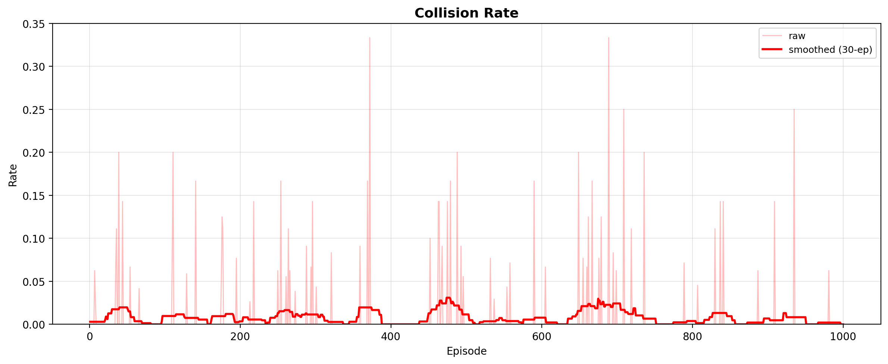
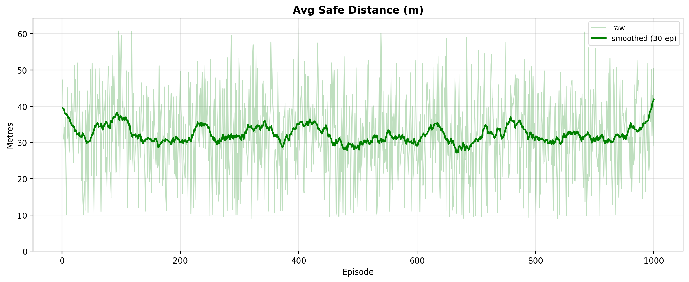
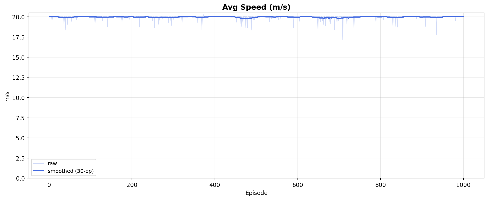
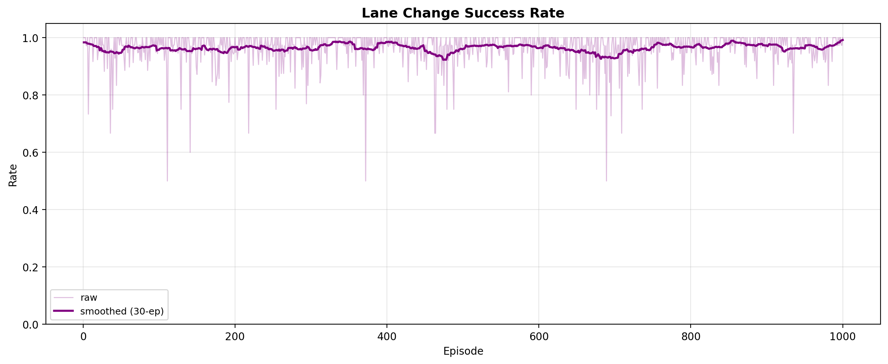
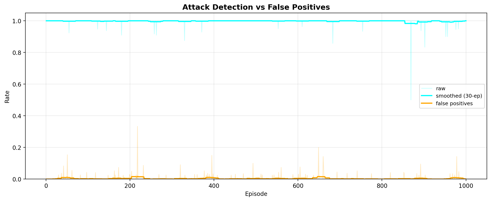
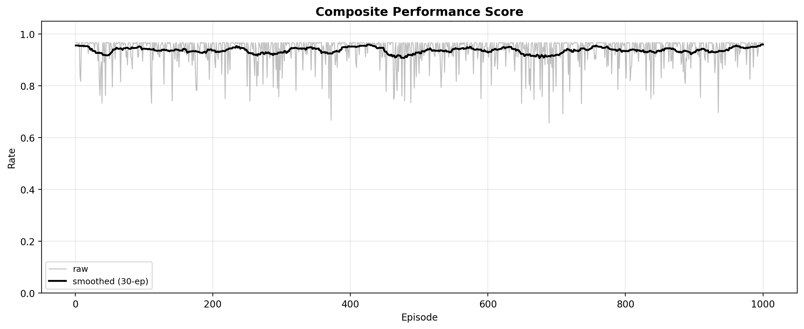

# Adversarial AV Control: Secure Autonomous Driving with GPS Spoofing Detection

A Reinforcement Learning framework for safe autonomous driving under **GPS spoofing attacks**, built on `highway-v0` with a **RecurrentPPO (MlpLstmPolicy) + MAPE-K self-adaptation loop**.

The agent jointly learns **driving (speed control, distance keeping, lane changes)** and **attack detection (declare / mitigate spoofed GPS)**, trained with a 4-phase curriculum over **3,000,000 timesteps** and validated in an independent **1,000-episode evaluation**.

> All figures below are from the **evaluation phase** (`results/` → `pics/`). Training curves and code are available in this repository.

---

## Table of Contents

- [Overview](#overview)
- [System Architecture](#system-architecture)
- [Key Results (Evaluation, 1000 episodes)](#key-results-evaluation-1000-episodes)
- [Method](#method)
  - [Curriculum Learning Strategy](#curriculum-learning-strategy)
  - [Training Phase Summary](#training-phase-summary)
- [Evaluation Phase Results](#evaluation-phase-results)
  - [1. Collision Rate](#1-collision-rate)
  - [2. Average Safe Distance](#2-average-safe-distance)
  - [3. Average Speed](#3-average-speed)
  - [4. Lane-Change Success Rate](#4-lane-change-success-rate)
  - [5. GPS Spoofing Detection vs False Positives](#5-gps-spoofing-detection-vs-false-positives)
  - [6. Overall Performance Score](#6-overall-performance-score)
- [Repository Structure](#repository-structure)
- [Installation](#installation)
- [Usage](#usage)
- [License](#license)

---

## Overview

Autonomous vehicles depend on GPS for localization and planning, but GPS is vulnerable to **spoofing**: false positional offsets that can cause collisions or off-route behavior.

This project trains a unified policy that:

1. Drives safely in dense, dynamic highway traffic.
2. Detects spoofed GPS in real time from temporal observation history (LSTM).
3. Avoids false alarms that would trigger costly unnecessary countermeasures.

Self-adaptation is handled by a **MAPE-K loop** (`src/mapek_loop.py`) that monitors safety / detection metrics and adapts (e.g. speed-cap, best-model tracking) during training and evaluation.

---

## System Architecture

How the pieces fit together — from spoofed sensors to safe actions:

**1. Attack-aware environment (`src/unified_environment.py`).**
Wraps `highway-v0` and adds a GPS-spoofing layer. Observation is 27-d: flattened highway state (25-d) + raw GPS integrity signal + GPS exponential moving average. Spoofing follows a Markov chain (new attack `p_start = 0.05`, persistence `p_continue` set by curriculum), so attacks arrive in temporal bursts rather than i.i.d. noise. Clean vs. spoofed GPS distributions deliberately overlap (`N(0.75, 0.15)` vs. `N(0.40, 0.15)`), forcing the agent to use history rather than a single reading.

**2. Joint driving + detection policy.**
Action space is `MultiDiscrete([5, 2])`: driving action (lane-left / idle / lane-right / faster / slower) plus a mitigate-spoof flag. Reward combines driving (60–70%) with security (+2.0 true positive, −2.0 false positive / miss, +0.5 true negative), plus distance-keeping penalty, idle penalty, and a small lane-change bonus. Policy is **RecurrentPPO with MlpLstmPolicy** (128-d MLP extractor, 128-unit LSTM), so detection is learned temporally, end-to-end with driving.

**3. MAPE-K self-adaptation (`src/mapek_loop.py`).**
Monitor → Analyse → Plan → Execute loop scores each episode with a weighted composite (collisions 45%, safe distance 20%, detection 20%, speed 10%, lane-change 5%). It tracks the best checkpoint (`best_mapek_model`), and on sustained degradation decays learning rate, boosts entropy for re-exploration, and activates a speed-cap penalty. In evaluation it runs in `eval_only` mode (monitoring without mutation).

---

## Key Results (Evaluation, 1000 episodes)

Best model, independent benchmark, 1,000 episodes:

| Metric | Mean | Std | Interpretation |
|---|---|---|---|
| **Collision rate** | **0.78%** | 3.34% | Near-zero; failures only in multi-agent edge cases |
| **Safe distance** | **32.19 m** | — | Wide proactive buffer, no tailgating |
| **Average speed** | **19.97 m/s (~71.89 km/h)** | — | Efficient, not overly conservative |
| **Lane-change success** | **96.42%** | — | Attempted in 100% of episodes |
| **Spoofing detection rate** | **99.80%** | 1.97% | Almost every spoofed step caught |
| **False-positive rate** | **0.37%** | — | Clean GPS rarely flagged |
| **Composite score** | **0.937 (93.68%)** | — | Safety + efficiency + detection |

---

## Method

### Curriculum Learning Strategy

Direct training under short, hard-to-detect spoofing bursts causes policy collapse. We therefore use curriculum learning where traffic stays as `highway-v0` throughout, while **attack temporal detectability** is progressively reduced via the Markov persistence probability `p_continue`.

Mean burst length ≈ `1 / (1 - p_continue)`:

| Phase | Steps | `p_continue` | Mean burst | Focus |
|---|---|---|---|---|
| **1 – Initialization** | 0 – 500k | 0.98 | ~50 steps | Long, detectable bursts. Learn basic velocity control, distance keeping, preliminary detection signatures. |
| **2 – Transition** | 500k – 1.2M | 0.92 | ~12 steps | More frequent anomalies. Refine collision avoidance, adapt to GPS triggers. |
| **3 – Target difficulty** | 1.2M – 2.5M | 0.85 | ~7 steps | Short bursts. Learn fast response without raising false alarms. |
| **4 – Stabilization** | 2.5M – 3.0M | 0.85 | ~7 steps | Same difficulty as Phase 3. Stabilize joint driving–detection policy. |

Checkpoints evaluated every 50,000 steps. Implementation: `src/train_unified_agent.py` (`CURRICULUM`, `make_env(p_continue)`).

### Training Phase Summary

GPS detector refinement across curriculum:

- **Detection Rate (TPR):** started at **90.81%** at 50k steps, then converged to **98.5–100.0%** in Phases 3–4, with sustained **100.0%** in final Phase-4 checkpoints.
- **False Positive Rate (FPR):** peaked at **25.03%** during early Phase-1 exploration, fell below **10%** in Phases 2–3 as the agent learned to separate true attacks from noise, and stabilized near zero (minor fluctuations <5%) in Phase 4.

This dual convergence shows the detector learned robust, highly specific features: it catches attacks while preventing false alarms.

---

## Evaluation Phase Results

Independent benchmark with the best checkpoint (`models/best_mapek_model`): **1,000 simulation episodes**, deterministic policy.

### 1. Collision Rate

Mean **0.78% (SD = 3.34%)**, with the vast majority of episodes collision-free. Rare failures are confined to highly complex multi-agent edge scenarios with aggressive neighbours. Confirms the safety layer generalized without overfitting.



### 2. Average Safe Distance

Time-averaged minimum Euclidean distance to the nearest surrounding vehicle. Mean **~32.19 m**, showing proactive spacing and a wide margin to absorb unpredictable dynamics.



### 3. Average Speed

Mean **~19.97 m/s (~71.89 km/h)**, closely matching optimal target velocity for mixed highway driving. Balances safety constraints with efficient traffic flow — no overly conservative crawling.



### 4. Lane-Change Success Rate

Mean **96.42%**, with maneuvers attempted in **100%** of evaluation episodes — active, decisive navigation (opportunistic overtakes and repositioning) rather than passive lane-keeping, with minimal aborted attempts.



> If `pics/04_lane_change_success.png` is missing, re-run evaluation: it is generated as `results/04_lane_change_success.png` by `src/main.py`.

### 5. GPS Spoofing Detection vs False Positives

Mean detection **99.80% (SD = 1.97%)** with mean false-positive rate only **0.37%**. The policy identifies almost all compromised GPS signals while rarely flagging clean signals — critical for deployment, where each false alarm triggers an unnecessary countermeasure.



### 6. Overall Performance Score

Composite of low collision frequency, safe spacing, speed regulation, lane-change execution, and spoofing detection (see `SCORE_WEIGHTS` in `src/mapek_loop.py`). Mean **0.937 (93.68%)**, validating a reliable, safe, and efficient autonomous driving framework.



> If `pics/06_performance_score.png` is missing, copy `results/06_performance_score.png` after running `src/main.py`. An overview grid is also saved as `results/00_all_metrics_overview.png`.

---

## Repository Structure

```text
.
├── pics/                          # Evaluation figures used in this README
│   ├── 01_collision_rate.png
│   ├── 02_safe_distance.png
│   ├── 03_avg_speed.png
│   ├── 04_lane_change_success.png
│   ├── 05_detection_vs_fp.png
│   └── 06_performance_score.png
├── src/
│   ├── train_unified_agent.py     # 4-phase curriculum training (RecurrentPPO)
│   ├── main.py                    # 1000-episode evaluation + plots + JSON stats
│   ├── unified_environment.py     # highway-v0 wrapper + GPS spoofing + metrics
│   └── mapek_loop.py              # MAPE-K monitor/analyze/plan/execute + scoring
├── models/                        # Checkpoints (incl. best_mapek_model)
├── results/                       # experiment_results.json + generated plots
├── training_results/              # training_log.json + training curves
├── requirements.txt
└── README.md
```

---

## Installation

```bash
git clone https://github.com/your-username/Adversarial-AV-Control.git
cd Adversarial-AV-Control

python -m venv venv
source venv/bin/activate  # Windows: venv\Scripts\activate

pip install -r requirements.txt
```

Requires: `gymnasium`, `highway-env`, `stable-baselines3`, `sb3-contrib` (RecurrentPPO), `torch`, `matplotlib`, `numpy`.

---

## Usage

### Train (4-phase curriculum, 3M steps)

```bash
python src/train_unified_agent.py
```

Outputs: `models/` checkpoints, `training_results/training_log.json` + per-metric curves with phase shading, TensorBoard logs in `unified_ppo_tensorboard/`.

### Evaluate (1000 episodes, best model)

```bash
python src/main.py
```

Loads `models/best_mapek_model`, runs 1,000 episodes on `highway-v0`, saves:

- `results/experiment_results.json` (means / stds)
- `results/01_collision_rate.png` … `results/06_performance_score.png`
- `results/00_all_metrics_overview.png`

Copy desired plots into `pics/` to update this README.

---

## License

Distributed under the **MIT License**. See `LICENSE` for details.
